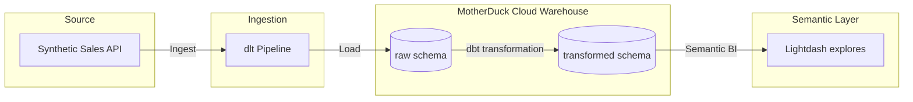

# Retail Analytics & Sales Intelligence Platform

A modern data stack implementation designed to ingest, transform, and visualize e-commerce transaction data. This project leverages **dlt** (Data Load Tool) for robust raw ingestion, **MotherDuck** (Cloud DuckDB) as the analytical data warehouse, **dbt Core** for dimensional modeling (Kimball Star Schema), and **Lightdash** for semantic BI exploration.

---

## Architecture Overview



### Components:
1. **Ingestion Engine (`dlt`)**: Extracts customers, products, and orders datasets. Automatically infers schemas, handles data types, and loads data directly into MotherDuck.
2. **Cloud Data Warehouse (`MotherDuck`)**: Provides serverless cloud analytics built on DuckDB, serving as the central storage engine.
3. **Data Transformation (`dbt Core`)**: Standardizes raw tables, implements dimensions/facts models, and manages data quality tests.
4. **BI & Analytics (`Lightdash`)**: Leverages dbt `schema.yml` metadata directly to expose key metrics and dimensions with zero-duplication of business logic.

---

## Project Structure

```
.
├── pipeline.py                # dlt ingestion script
├── requirements.txt           # Python dependencies
├── pyproject.toml             # uv configuration
└── dbt_project/               # dbt transformation layer
    ├── dbt_project.yml        # dbt project configuration
    ├── profiles_motherduck.yml# Warehouse connection profiles
    ├── macros/                # Custom utility macros
    └── models/                # SQL transformation models
        ├── staging/           # Cleaned source tables (stg_*)
        └── marts/             # Dimension & fact tables (dim_*, fact_*)
```

---

## Setup & Execution

### 1. Prerequisites
Ensure you have Python 3.10+ and `uv` installed. Set your MotherDuck access token in a local `.env` file:
```env
MOTHERDUCK_TOKEN="your_motherduck_access_token"
```

### 2. Install Dependencies
Initialize the virtual environment and install all packages:
```bash
uv pip install -r requirements.txt
```

### 3. Run Ingestion
Execute the ingestion script to generate mock sales records and load them to MotherDuck:
```bash
uv run --env-file .env python pipeline.py
```

### 4. Run Transformations
Build and test the dimensional models in MotherDuck:
```bash
cd dbt_project
uv run --env-file .env dbt deps
uv run --env-file .env dbt run
uv run --env-file .env dbt test
```

---

## Data Models (transformed schema)

* **`fact_orders`**: The core fact table containing order details, quantity, pricing, and calculated revenue. Joined directly to dimension tables.
* **`dim_customers`**: Standardized customer attributes including contact details, geography, and sign-up dates.
* **`dim_products`**: Product catalog metadata, classification, and unit prices.
